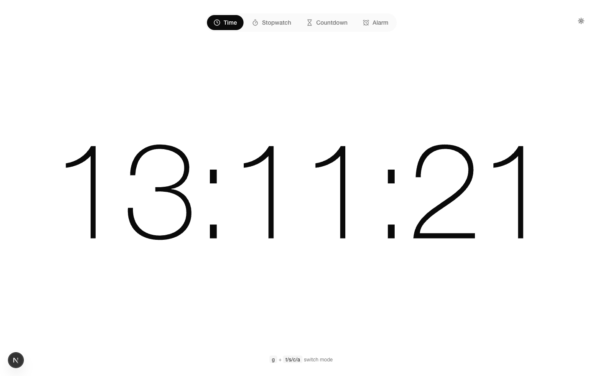
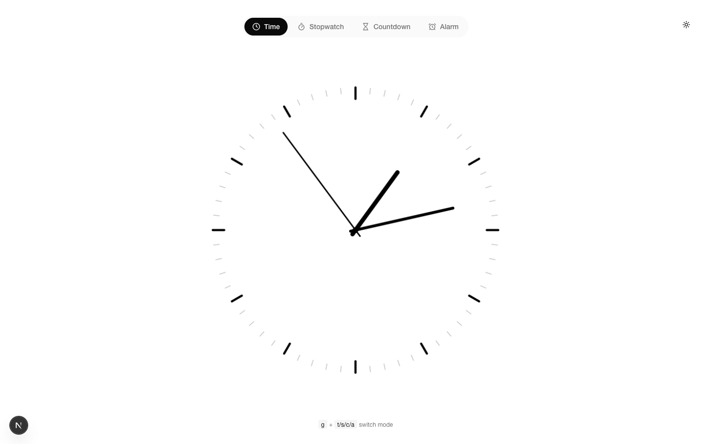
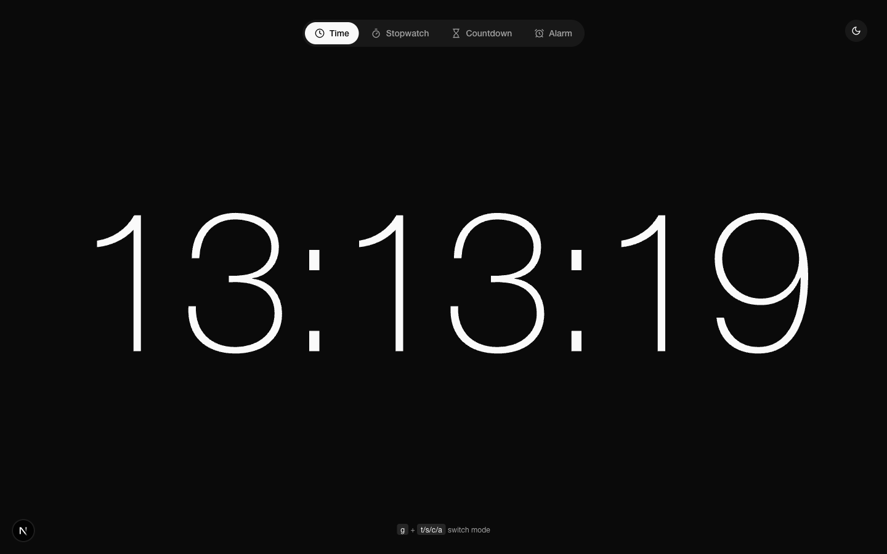
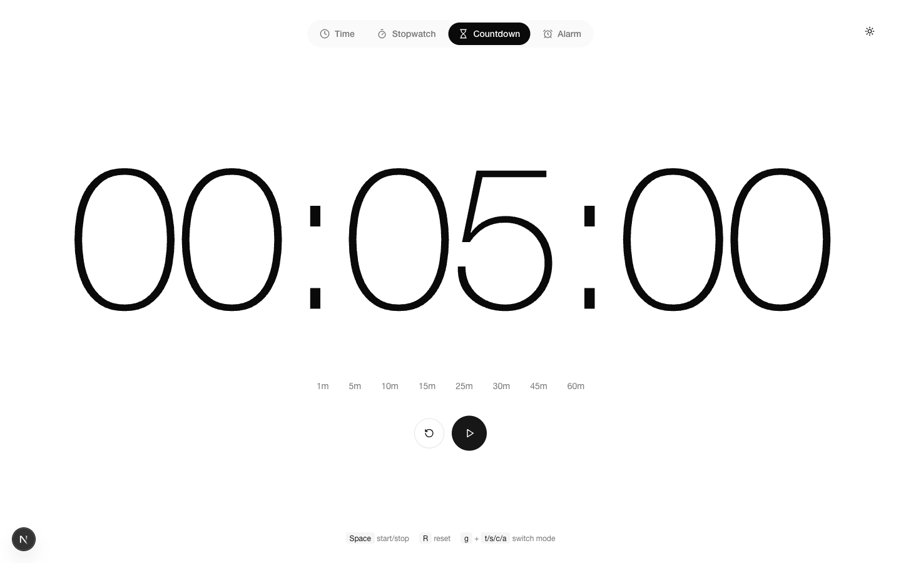
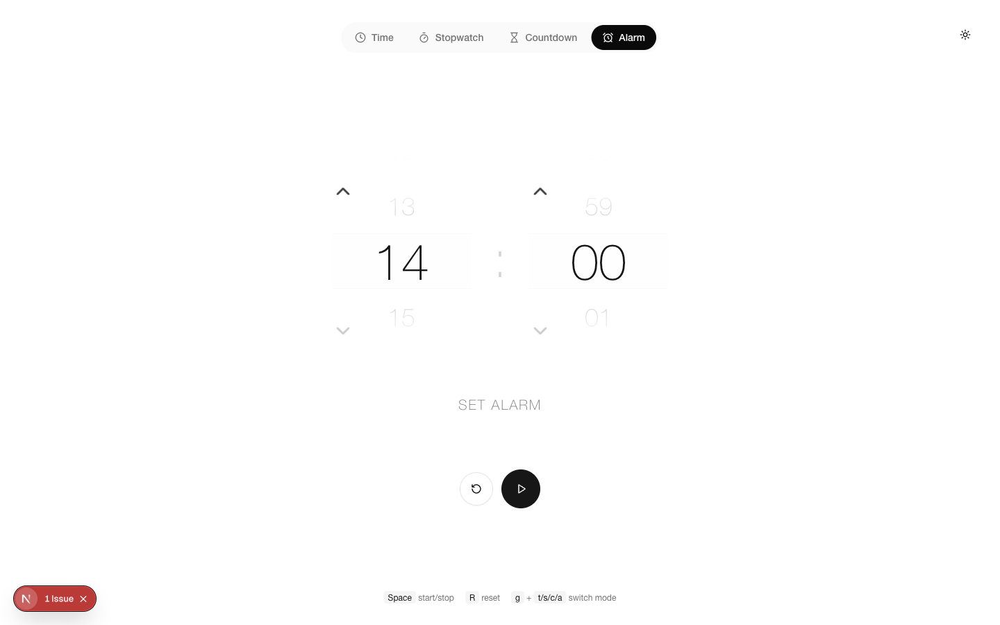

# Presentation timer

*Automatically synced with your [v0.app](https://v0.app) deployments*

## Overview

This repository will stay in sync with your deployed chats on [v0.app](https://v0.app).
Any changes you make to your deployed app will be automatically pushed to this repository from [v0.app](https://v0.app).

## Deployment

Your project is live at:

**[https://vercel.com/ykpersonal/v0-presentation-timer](https://vercel.com/ykpersonal/v0-presentation-timer)**

## Build your app

Continue building your app on:

**[https://v0.app/chat/hkUngttmsFy](https://v0.app/chat/hkUngttmsFy)**

## How It Works

1. Create and modify your project using [v0.app](https://v0.app)
2. Deploy your chats from the v0 interface
3. Changes are automatically pushed to this repository
4. Vercel deploys the latest version from this repository

## Screenshots

### Time

### Time (Analog)

### Time (Dark)

### Stopwatch

### Countdown

### Alarm

